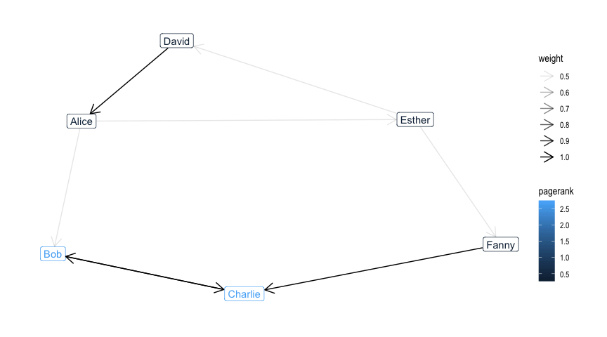

R interface for GraphFrames
================

[](https://travis-ci.org/rstudio/graphframes)
[](https://codecov.io/github/rstudio/graphframes?branch=master)
[](https://cran.r-project.org/package=graphframes)

  - Support for [GraphFrames](https://graphframes.github.io/) which aims
    to provide the functionality of
    [GraphX](http://spark.apache.org/graphx/).
  - Perform graph algorithms like:
    [PageRank](https://graphframes.github.io/api/scala/index.html#org.graphframes.lib.PageRank),
    [ShortestPaths](https://graphframes.github.io/api/scala/index.html#org.graphframes.lib.ShortestPaths)
    and many [others](https://graphframes.github.io/api/scala/#package).
  - Designed to work with [sparklyr](https://spark.rstudio.com) and the
    [sparklyr extensions](http://spark.rstudio.com/extensions.html).

## Installation

For those already using `sparklyr` simply run:

``` r
install.packages("graphframes")
# or, for the development version,
# devtools::install_github("rstudio/graphframes")
```

Otherwise, install first `sparklyr` from CRAN using:

``` r
install.packages("sparklyr")
```

The examples make use of the `highschool` dataset from the `ggplot`
package.

## Getting Started

We will calculate [PageRank](https://en.wikipedia.org/wiki/PageRank)
over the built-in “friends” dataset as follows.

``` r
library(graphframes)
library(sparklyr)
library(dplyr)

# connect to spark using sparklyr
sc <- spark_connect(master = "local", version = "2.3.0")

# obtain the example graph
g <- gf_friends(sc)

# compute PageRank
results <- gf_pagerank(g, tol = 0.01, reset_probability = 0.15)
results
```

    ## GraphFrame
    ## Vertices:
    ##   $ id       <chr> "f", "b", "g", "a", "d", "c", "e"
    ##   $ name     <chr> "Fanny", "Bob", "Gabby", "Alice", "David", "Charlie",...
    ##   $ age      <int> 36, 36, 60, 34, 29, 30, 32
    ##   $ pagerank <dbl> 0.3283607, 2.6555078, 0.1799821, 0.4491063, 0.3283607...
    ## Edges:
    ##   $ src          <chr> "b", "c", "d", "e", "a", "a", "e", "f"
    ##   $ dst          <chr> "c", "b", "a", "f", "e", "b", "d", "c"
    ##   $ relationship <chr> "follow", "follow", "friend", "follow", "friend",...
    ##   $ weight       <dbl> 1.0, 1.0, 1.0, 0.5, 0.5, 0.5, 0.5, 1.0

We can then visualize the results by collecting the results to R:

``` r
library(tidygraph)
library(ggraph)

vertices <- results %>%
  gf_vertices() %>%
  collect()

edges <- results %>%
  gf_edges() %>%
  collect()

edges %>%
  as_tbl_graph() %>%
  activate(nodes) %>%
  left_join(vertices, by = c(name = "id")) %>%
  ggraph(layout = "nicely") +
  geom_node_label(aes(label = name.y, color = pagerank)) +
  geom_edge_link(
    aes(
      alpha = weight,
      start_cap = label_rect(node1.name.y),
      end_cap = label_rect(node2.name.y)
    ),
    arrow = arrow(length = unit(4, "mm"))
  ) +
  theme_graph(fg_text_colour = 'white')
```

<!-- -->

## Further Reading

Appart from calculating `PageRank` using `gf_pagerank`, many other
functions are available, including:

  - `gf_bfs()`: Breadth-first search (BFS).
  - `gf_connected_components()`: Connected components.
  - `gf_shortest_paths()`: Shortest paths algorithm.
  - `gf_scc()`: Strongly connected components.
  - `gf_triangle_count()`: Computes the number of triangles passing
    through each vertex and others.
  - `gf_degrees()`: Degrees of vertices

For instance, one can calculate the degrees of vertices using
`gf_degrees` as follows:

``` r
gf_friends(sc) %>% gf_degrees()
```

    ## # Source: spark<?> [?? x 2]
    ##   id    degree
    ## * <chr>  <int>
    ## 1 f          2
    ## 2 b          3
    ## 3 a          3
    ## 4 c          3
    ## 5 e          3
    ## 6 d          2

Finally, we disconnect from Spark:

``` r
spark_disconnect(sc)
```
