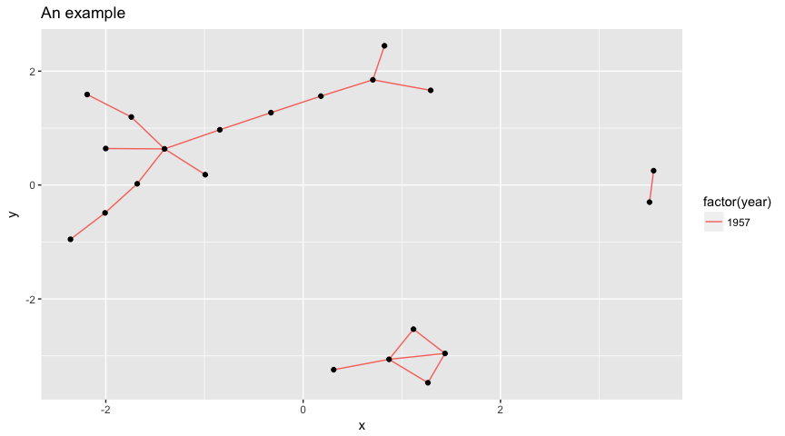

R interface for GraphFrames
================

[](https://travis-ci.org/rstudio/graphframes) [](https://codecov.io/github/rstudio/graphframes?branch=master) [](https://cran.r-project.org/package=graphframes)

-   Support for [GraphFrames](https://graphframes.github.io/) which aims to provide the functionality of [GraphX](http://spark.apache.org/graphx/).
-   Perform graph algorithms like: [PageRank](https://graphframes.github.io/api/scala/index.html#org.graphframes.lib.PageRank), [ShortestPaths](https://graphframes.github.io/api/scala/index.html#org.graphframes.lib.ShortestPaths) and many [others](https://graphframes.github.io/api/scala/#package).
-   Designed to work with [sparklyr](https://spark.rstudio.com) and the [sparklyr extensions](http://spark.rstudio.com/extensions.html).

Installation
------------

For those already using `sparklyr` simply run:

``` r
install.packages("graphframes")
# or, for the development version,
# devtools::install_github("rstudio/graphframes")
```

Otherwise, install first `sparklyr` from CRAN using:

``` r
install.packages("sparklyr")
```

The examples make use of the `highschool` dataset from the `ggplot` package.

Getting Started
---------------

We will calculate [PageRank](https://en.wikipedia.org/wiki/PageRank) over the `highschool` dataset as follows:

``` r
library(graphframes)
library(sparklyr)
library(dplyr)

# connect to spark using sparklyr
sc <- spark_connect(master = "local", version = "2.1.0")

# copy highschool dataset to spark
highschool_tbl <- copy_to(sc, ggraph::highschool, "highschool")

# create a table with unique vertices using dplyr
vertices_tbl <- sdf_bind_rows(
  highschool_tbl %>% distinct(from) %>% transmute(id = from),
  highschool_tbl %>% distinct(to) %>% transmute(id = to)
)

# create a table with <source, destination> edges
edges_tbl <- highschool_tbl %>% transmute(src = from, dst = to)

gf_graphframe(vertices_tbl, edges_tbl) %>%
  gf_pagerank(reset_prob = 0.15, max_iter = 10L, source_id = "1")
```

    ## GraphFrame
    ## Vertices:
    ##   $ id       <dbl> 12, 12, 59, 59, 1, 1, 20, 20, 45, 45, 8, 8, 9, 9, 26,...
    ##   $ pagerank <dbl> 1.216914e-02, 1.216914e-02, 1.151867e-03, 1.151867e-0...
    ## Edges:
    ##   $ src    <dbl> 13, 13, 13, 13, 13, 13, 13, 13, 13, 13, 13, 13, 13, 13,...
    ##   $ dst    <dbl> 6, 6, 6, 6, 6, 6, 6, 6, 6, 6, 6, 6, 6, 6, 6, 6, 22, 22,...
    ##   $ weight <dbl> 0.02777778, 0.02777778, 0.02777778, 0.02777778, 0.02777...

Further Reading
---------------

Appart from calculating `PageRank` using `gf_pagerank`, the following functions are available:

-   gf\_bfs: Breadth-first search (BFS).
-   gf\_connected\_components: Connected components.
-   gf\_shortest\_paths: Shortest paths algorithm.
-   gf\_scc: Strongly connected components.
-   gf\_triangle\_count: Computes the number of triangles passing through each vertex and others.

For instance, one can calcualte the degrees of vertices using `gf_degrees` as follows:

``` r
gf_graphframe(vertices_tbl, edges_tbl) %>% gf_degrees()
```

    ## # Source:   table<sparklyr_tmp_8f86ee63e8a> [?? x 2]
    ## # Database: spark_connection
    ##       id degree
    ##    <dbl>  <int>
    ##  1   55.     25
    ##  2    6.     10
    ##  3   13.     16
    ##  4    7.      6
    ##  5   12.     11
    ##  6   63.     21
    ##  7   58.      8
    ##  8   41.     19
    ##  9   48.     15
    ## 10   59.     11
    ## # ... with more rows

In order to visualize large `graphframe`s, one can use `sample_n` and then use `ggraph` with `igraph` to visualize the graph as follows:

``` r
library(ggraph)
library(igraph)

graph <- highschool_tbl %>%
  sample_n(20) %>%
  collect() %>%
  graph_from_data_frame()

ggraph(graph, layout = 'kk') + 
    geom_edge_link(aes(colour = factor(year))) + 
    geom_node_point() + 
    ggtitle('An example')
```



Finally, we disconnect from Spark:

``` r
spark_disconnect(sc)
```
